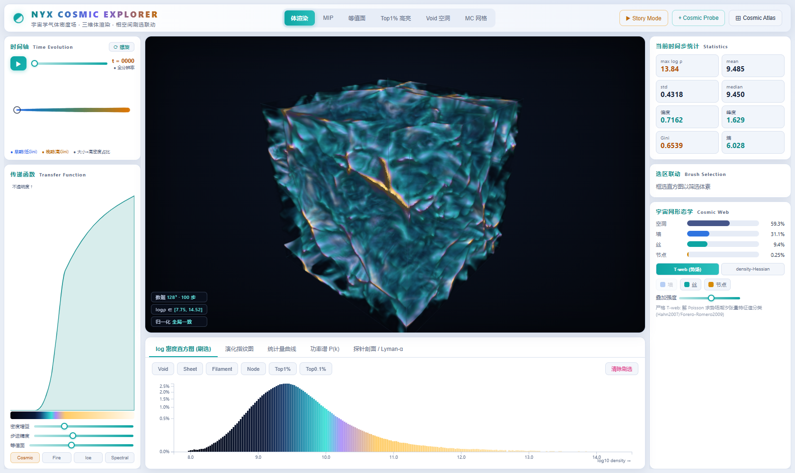

# Nyx Cosmic Explorer

基于本地 **Nyx 宇宙学模拟**气体密度场（100 个时间步、128³）的交互式三维体数据可视分析系统。
Web 前端用 **Three.js + WebGL2 3D 纹理光线步进**做全分辨率实时体渲染，**D3** 做联动图表；
Python 做预处理与统计。核心能力：体渲染多模式、时间演化、**相空间刷选统计-空间双向联动**、
宇宙网形态学分类（Cosmic Atlas）、合成莱曼-α 探针（Cosmic Probe）、演化指纹图与功率谱。



---

## 1. 数据事实

- 路径：`Nyx/0000.dat ~ 0099.dat`；单文件 8,388,608 B = 2,097,152 `float32` = 128×128×128。
- little-endian `float32`，**列优先**（z 变化最快）：`np.fromfile('<f4').reshape((128,128,128), order='F')` → `(z,y,x)`。
- 物理量为气体密度场；**探查确认存储值已是 log-density**（范围 ≈ 7.75–14.52，无 0/负值），故管线直接当作 log 密度，不再取 log。

## 2. 环境准备

```bash
# Python (预处理 / 统计 / 静态图)
pip install -r requirements.txt

# 前端
npm install
```

要求：Python 3.10+，Node 18+，支持 WebGL2 + float 纹理线性插值的现代浏览器（Chrome/Edge/Firefox）。

## 3. 预处理（首次运行，生成 public/data）

```bash
python preprocess/explore.py       # 数据探查 + 轴向核对图 (outputs/explore/)
python preprocess/preprocess.py    # metadata/stats/histograms/powerspectrum + u16 体数据 + 预览  (~1 min)
python preprocess/morphology.py    # density-Hessian 形态学标签 + 连通域分析 (labels/ + morphology.json)
python preprocess/tweb.py          # 严格 T-web: 解 Poisson 求势场潮汐张量分类 (labels_tweb/)
python preprocess/mc_export.py     # Marching Cubes 真实三角网格 (meshes/ + mc_manifest.json)
python preprocess/density_check.py # log 底数/绝对密度的质量守恒检验 (mass_conservation.png)
python preprocess/figures.py       # 报告静态统计图 (outputs/)
python preprocess/figures_rich.py  # 丰富版静态图: 莱曼-α/形态学切片/骨架/连通域/双步对比 + 演化与穿越 GIF
```

生成约 **860 MB** 静态数据于 `public/data/`（400 MB u16 体数据 + 200 MB density-Hessian 标签 + 200 MB T-web 标签 + 31 MB MC 网格 + 25 MB 预览 + json）。

## 4. 启动可视化系统

```bash
npm run dev      # http://localhost:5173/
```

大体数据通过 Vite 静态 + Range 请求**按需流式加载**，前端做 **LRU 缓存 + 邻步预取**；
播放/拖动时用 64³ 预览保帧率，停稳后自动换全分辨率。

## 5. 功能导览

- **中央 3D 主视图**：体渲染 / MIP / 等值面 / Top1% 高亮 / Void 空洞 / **MC 真实网格** 六模式；旋转/缩放/平移；梯度光照。
- **左侧**：时间轴（**线性 ↔ 螺旋**可切换，节点颜色=Gini，大小=高密度占比）、播放控制、自适应传递函数编辑（Cosmic/Fire/Ice/Spectral）。
- **右侧**：当前步统计、选区联动统计、宇宙网形态学占比 + Cosmic Atlas 控制。
- **底部**：log 密度直方图（**D3 刷选**）、演化指纹图、统计量曲线、功率谱 P(k)、探针剖面/莱曼-α。
- **相空间刷选**：直方图框选 → 3D 实时只显示匹配体素 + 选区体素数/占比/均值/最大值；快捷按钮 Void/Sheet/Filament/Node/Top1%/Top0.1%。
- **Cosmic Atlas**：叠加 void/sheet/filament/node 形态学分类（金/青/蓝），**density-Hessian ↔ 严格 T-web 一键切换**。
- **MC 真实网格**：Marching Cubes 抽取的等值面三角网格，场景光照渲染。
- **Cosmic Probe**：在 3D 中点击拉出视线 → 实时密度剖面 + 莱曼-α proxy 吸收谱。
- **Story Mode**：一键叙事导览“均匀→成丝→分化→图谱”。

## 6. 工程结构

```
preprocess/        explore.py / preprocess.py / morphology.py / tweb.py / mc_export.py / figures.py
public/data/       metadata|stats|histograms|powerspectrum|morphology|mc_manifest.json,
                   volumes/*.bin, labels/*.bin, labels_tweb/*.bin, meshes/*.bin, preview_u8.bin
src/
  state.js         中央状态 + 事件总线
  data/DataManager.js        流式加载 / LRU / 预览 / 视线采样
  visualization/   shaders.js, VolumeRenderer.js, TransferFunction.js
  charts/          Histogram, Fingerprint, TimeSeries, PowerSpectrum, Timeline, ProbePanel
  main.js          编排与 UI 装配
scripts/           shoot*.mjs  (headless 截图验证)
outputs/           报告静态图 + 截图
report_draft.md    答辩报告草稿
```

## 7. 物理限定（如实标注，避免过度宣称）

- **莱曼-α**：当前数据仅含密度，缺温度/电离态/速度场，采用密度驱动 proxy `τ = A·∫ρ^β ds`，**非严格辐射转移**。
- **形态学分类**：提供两种——① density-Hessian 近似（仅用密度场）；② **严格 T-web**（解 Poisson 求引力势潮汐张量，Hahn2007/Forero-Romero2009）。前端可切换对比。
- 传递函数阈值、刷选区间、形态学阈值均**基于真实分位数/调参**，非拍脑袋。

## 8. 验证

`scripts/shoot*.mjs` 用 headless Chromium（SwiftShader）加载系统、采集控制台错误并截图，
确认五种渲染模式、刷选联动、各图表与探针均正常工作、无运行时错误（见 `outputs/screens/`）。
> 注：SwiftShader 软渲染较慢，仅用于自动化验证；真实 GPU 上体渲染实时流畅。
```
node scripts/shoot.mjs            # 主界面
SHOTS=interact node scripts/shoot.mjs   # 各模式
node scripts/shoot_charts.mjs     # 图表 tab + 探针
node scripts/shoot_report.mjs     # 报告体渲染图
```
